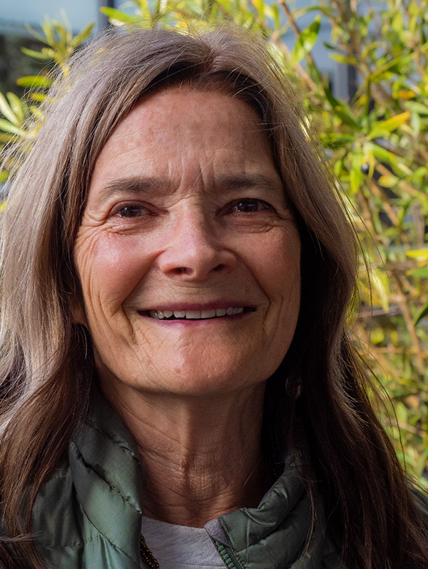
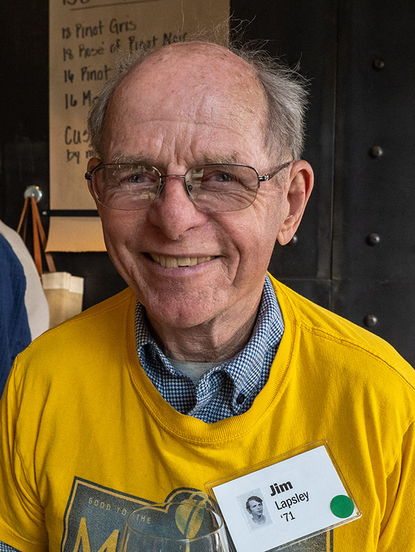
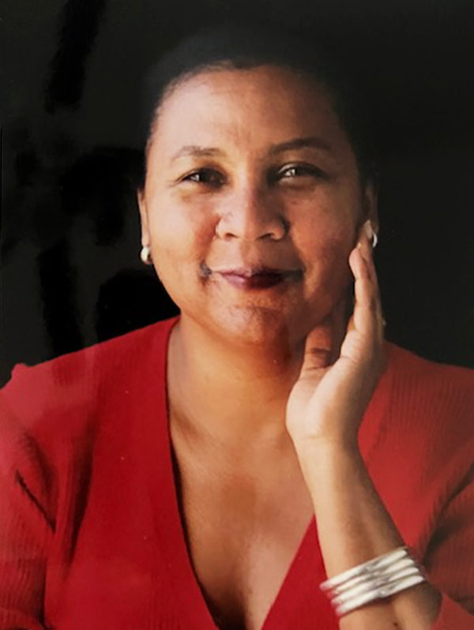
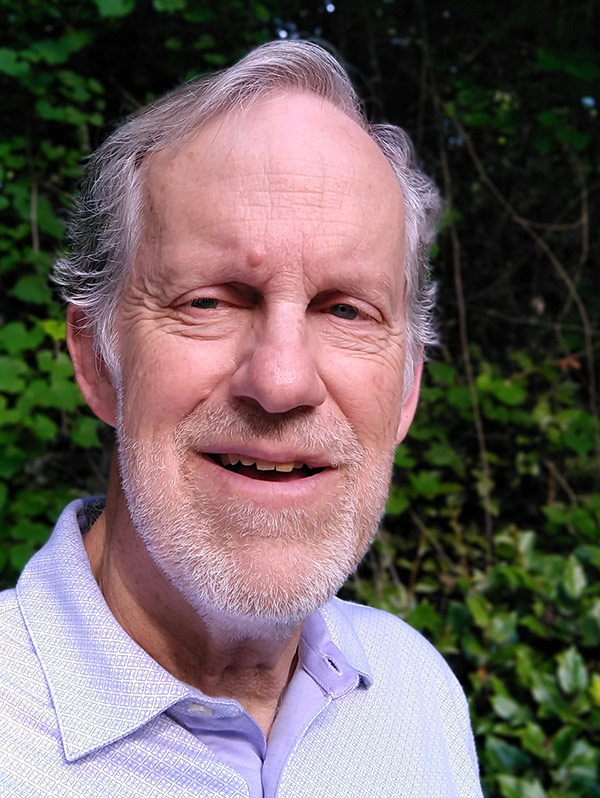
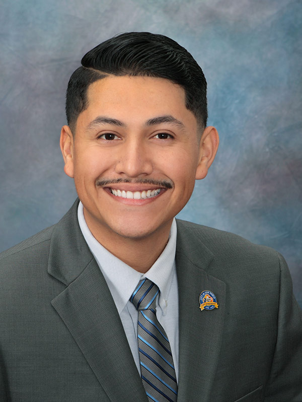
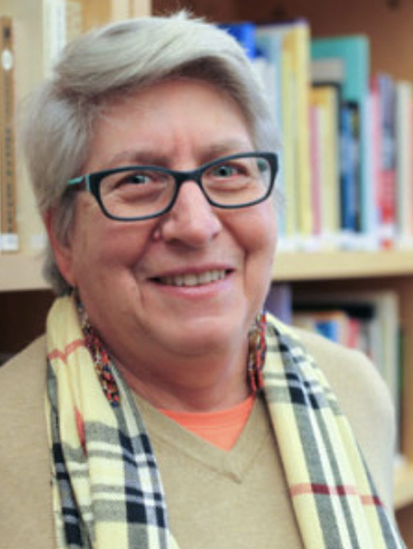

UC Santa Cruz recognizes and honors alumni who have demonstrated outstanding professional achievements, made distinct contributions to society, provided impactful contributions to UC Santa Cruz, and embodied the university’s values and spirit.

When the UCSC Alumni Association solicited nominations from members of the UCSC community, they were thrilled to receive over 70 wonderful nominations. Now, we are honored to announce the amazing alumni selected to receive this year’s alumni awards.

On Friday, October 27, 2023 we will honor and celebrate seven amazing alumni as they accept their alumni awards. We hope you will join us for a beautiful night of celebration. 

### Evening festivities include:

- **5:30 p.m. Welcome Reception**
- **6:00 p.m. Dinner**
- **6:45 p.m. Awards Celebration**
- **8:00 p.m. Dessert Reception**

## Fiat Lux Award

The Fiat Lux Award honors alumni and friends of UC Santa Cruz who have demonstrated outstanding achievement and distinguished service in support of the university’s programs and goals. Three Crown College alumni—Lisa Rose, Su Nerton, and Jim Lapsley—have provided distinguished service to UC Santa Cruz, and their support has made an indelible impact on the campus. They were founding members of the Crown Provost Advisory Committee (CPAC), and some of the projects they led include fundraising for the complete renovation of the Crown Library, upgrading the Fireside Lounge, and executing the first-ever Crown 50th reunion in 2022. To top it all off, they joined together to raise over $1 million toward the Crown College Endowment.  All three are outstanding advocates and supporters of UCSC. They have displayed exceptional dedication to UC Santa Cruz and accomplished an outstanding achievement that elevates the campus. 

 
  <!-- Su-->
  <section class="profile-w-media left">
    

      

        

          

              <h3 class="underline"><strong>Susan (Su) Nerton</strong> (Crown ’71, psychology; computer and information science ’87)</h3>
              
Sue’s four years at UCSC created an awareness of how excellent integrated education could be a springboard to whatever came next. She was the first in her extended family to graduate from a college or university. She spent some quality time contemplating next steps, but knew teaching was her calling. Math was always a first love; personal computers were in their infancy and she found them intriguing.

              <a class="button secondary" href="susan-norten">Read More</a>
          

          

            

              
            
    
          

        

      

    

  </section>
  <!-- End Su-->
  <!-- Lisa -->
  <section class="profile-w-media left">
    

      

        

          

              <h3 class="underline"><strong>Lisa Rose</strong> (Crown ’72, Russian literature)</h3>
              
While at Crown College, Lisa pursued an interest in black-and-white photography. She was selected to teach a for-credit class in darkroom photography to lower-division students during her senior year. Lisa enjoyed teaching, and two years later returned to UCSC for a secondary teaching credential. After two years of teaching continuation high school on the Central Coast, Lisa moved to New Zealand where she taught math at the Nelson College for Girls for two years before returning to live and work in Santa Cruz in 1978.

              <a class="button secondary" href="lisa-rose">Read More</a>
          

          

            

              
            
    
          

        

      

    

  </section>
  <!-- End Lisa -->
  <!-- Jim -->
  <section class="profile-w-media left">
    

      

        

          

              <h3 class="underline"><strong>Jim Lapsley</strong> (Crown ’71, history)</h3>
              
A native Californian, Jim Lapsley is a member of Crown College’s first four-year class (1967–1971).  He met his wife, Carol (Crown ’71), at Crown, and they married above the Quarry Amphitheater in 1971. Carol earned her special education teaching credential at UCSC.

              <a class="button secondary" href="jim-lapsley">Read More</a>
          

          

            

              
            
    
          

        

      

    

  </section>
  <!-- End Jim -->

## Alumni Achievement Award

The Alumni Achievement Award is presented to UC Santa Cruz graduates who are renowned for their distinguished professional achievement, leadership, and service to the community. The alumni receiving this award have made a positive impact in the lives of others and are recognized for their longevity and consistency of accomplishments over their professional lifetime. This year, we are presenting this award to two alumni who have made distinct contributions in their respective professions, and both are recognized for their notable achievements in their respective fields. Both are highly regarded for their professional achievements and contributions to society. Meet:

  <!-- bell -->
  <section class="profile-w-media left">
    

      

        

          

              <h3 class="underline"><strong>bell hooks</strong> (Ph.D. ’83, literature)</h3>
               <em>Posthumous</em>
              

              <a class="button secondary" href="bell-hooks">Read More</a>
          

          

            

              
            
    
          

        

      

    

  </section>
  <!-- End bell -->
   <!-- bell -->
  <section class="profile-w-media left">
    

      

        

          

              <h3 class="underline"><strong>Mark Phillips</strong> (Ph.D. ’77, astronomy)</h3>
              
Born in San Diego, Mark earned an undergraduate degree in astronomy in 1973 at San Diego State University.  After postdoctoral appointments at Cerro Tololo Inter-American Observatory (CTIO) in Chile and the Anglo-Australian Observatory in Australia, Mark joined the CTIO staff in 1982, where he eventually served as the CTIO assistant director from 1990–98.  He moved to the Carnegie Observatories in 1998, serving as associate director for the Magellan Telescopes from 2006–2017, and director of the Las Campanas Observatory from 2014–2017.

              <a class="button secondary" href="mark-phillips">Read More</a>
          

          

            

              
            
    
          

        

      

    

  </section>
  <!-- End bell -->

## Outstanding Recent Alumni Award

The Outstanding Recent Alumni Award honors alumni who have graduated within the past 10 years and who are recognized for their notable achievements. This year’s winner is applauded for his extraordinary professional achievements and his significant contributions to society. He reflects the values and mission of UCSC. Meet:

  <!-- Abel -->
  <section class="profile-w-media left">
    

      

        

          

              <h3 class="underline"><strong>Abel Pineda</strong> (Oakes ’14, sociology)</h3>
              
As a first-generation college graduate, Abel has consistently demonstrated an unwavering commitment to using his education and life experiences to improve society.

              <a class="button secondary" href="abel-pineda">Read More</a>
          

          

            

              
            
    
          

        

      

    

  </section>
  <!-- End Abel -->

## UCSC Ethos Award

The UC Santa Cruz Ethos Award recognizes UC Santa Cruz alumni whose work and contribution to their community embodies and reflects the ethos of UCSC. The award is given to alumni who embrace diversity, strive for an inclusive community, and encourage the free exchange of ideas. The awardee is committed to serving society and advancing knowledge; displaying respect, trust, and support that strengthens their community; and advocating for equitable access, respect, and human dignity. Alumni deserving of this award celebrate others’ heritage, achievements, uniqueness, and contributions. This year’s recipient, as both an alumna and faculty emerita, embodies the Banana Slug spirit and expresses it through her work. Meet:

  <!-- Abel -->
  <section class="profile-w-media left">
    

      

        

          

              <h3 class="underline"><strong>Bettina Aptheker</strong> (Ph.D. ’83, history of consciousness)</h3>
              
Bettina Aptheker is distinguished professor emerita, Feminist Studies Department, at UCSC. She held a UC Presidential Chair in Feminist Critical Race & Ethnic Studies (2012–15, with Karen Tei Yamashita, emerita professor of literature), and was the first holder of the Peggy & Jack Baskin Foundation Endowed Presidential Chair for Feminist Studies (2017–21).

              <a class="button secondary" href="bettina-aptheker">Read More</a>
          

          

            

              
            
    
          

        

      

    

  </section>
  <!-- End Abel -->

