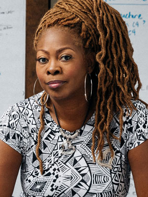
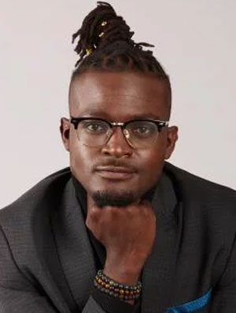
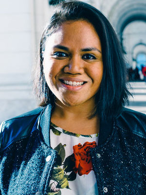

Join us as we celebrate the renaming of College Ten in honor of John R. Lewis. We will celebrate this momentous occasion with powerful speakers and performances, and a call to action to empower our students to seek justice and create necessary trouble in their educational journey and beyond.

## Speakers/performers:

We are honored to be hosting [LaTosha Brown](http://www.mslatoshabrown.com/), Co-Founder of  [Black Voters Matter](https://blackvotersmatterfund.org), [Black Voters Matter Fund](https://blackvotersmatterfund.org/) and [Black Voters Matter Capacity Building Institute](https://bvmcapacitybuilding.org/). In strong resonance to the values and life’s work of John R. Lewis, LaTosha works tirelessly to catalyze voter registration, voter turnout, and political power in Black, often marginalized, communities. She is an award-winning organizer, philanthropic consultant, political strategist and jazz singer. LaTosha possesses over twenty years of experience working in the non-profit and philanthropy sectors, which she leverages to inspire action promoting political empowerment, social justice, economic development, leadership development, and civil rights. She is a nationally recognized voice speaking truth to power, raising consciousness, and leading from “a deep love for humanity, democracy and justice.”

We are delighted to announce that [Wisdom Cole](https://naacp.org/people/wisdom-o-cole), UCSC alumnus and civil rights advocate and national organizer, will also be speaking at the Dedication of John R. Lewis College. As the NAACP’s National Director for Youth and College Division, he works to train and mobilize young people across the country in effective local, state, and national organizing tactics and tools to build political power. Noted as one of Complex Life's 32 Young Activists who are Changing the world, Wisdom has been featured on NPR, VICE, NBC Washington News, Brooking Institute, and The Economist as an advocate for youth voter turnout through issue-based campaign organizing.

We also welcome back our very own [Terisa Siagatonu](https://www.terisasiagatonu.com/), an award-winning poet, teaching artist, mental health educator, and community leader born and rooted in the Bay Area. Her presence in the poetry world as a queer Samoan woman and activist has granted her opportunities to perform and speak in places ranging from the White House (during the Obama administration) to the UN Conference on Climate Change in Paris, France. The most memorable moment in her career was receiving President Obama’s Champion of Change Award in 2012 for her activism as a spoken word poet/organizer in her Pacific Islander community. Terisa is an alumna of UCSC College Ten/John R. Lewis College, and wrote her first poem in her dorm room in House 6/Angela Davis. 

  
  <section class="profile-w-media left">
    

      

        

          

              <h2 class="underline">LaTosha Brown</h2>
              

              <a href="http://www.mslatoshabrown.com/">LaTosha Brown</a> is Co-Founder of <a href="https://blackvotersmatterfund.org">Black Voters Matter</a>, <a href="https://blackvotersmatterfund.org/">Black Voters Matter Fund</a> and <a href="https://bvmcapacitybuilding.org/">Black Voters Matter Capacity Building Institute</a>. In strong resonance to the values and life’s work of John R. Lewis, LaTosha works tirelessly to catalyze voter registration, voter turnout, and political power in Black, often marginalized, communities. She is an award-winning organizer, philanthropic consultant, political strategist and jazz singer. LaTosha possesses over twenty years of experience working in the non-profit and philanthropy sectors, which she leverages to inspire action promoting political empowerment, social justice, economic development, leadership development, and civil rights. She is a nationally recognized voice speaking truth to power, raising consciousness, and leading from “a deep love for humanity, democracy and justice.”

          

          

            

              
            
    
          

        

      

    

  </section>

  <section class="profile-w-media left">
    

      

        

          

              <h2 class="underline">Wisdom Cole</h2>
              

              <a href="https://naacp.org/people/wisdom-o-cole">Wisdom Cole</a> is a UCSC alumnus and civil rights advocate and national organizer, who will also be speaking at the Dedication of John R. Lewis College. As the NAACP’s National Director for Youth and College Division, he works to train and mobilize young people across the country in effective local, state, and national organizing tactics and tools to build political power. Noted as one of Complex Life's 32 Young Activists who are Changing the world, Wisdom has been featured on NPR, VICE, NBC Washington News, Brooking Institute, and The Economist as an advocate for youth voter turnout through issue-based campaign organizing.

  On his Twitter he identifies as  Griot, Organizer, and National Director for Youth & College Division, @NAACP <a href="https://twitter.com/wordsofwiz27">https://twitter.com/wordsofwiz27</a>
            

          

          

            

              
            
    
          

        

      

    

  </section>

  <section class="profile-w-media left">
    

      

        

          

              <h2 class="underline">Terisa Siagatonu</h2>
              

              <a href="https://www.terisasiagatonu.com/">Terisa Siagatonu</a> is an award-winning poet, teaching artist, mental health educator, and community leader born and rooted in the Bay Area. Her presence in the poetry world as a queer Samoan woman and activist has granted her opportunities to perform and speak in places ranging from the White House (during the Obama administration) to the UN Conference on Climate Change in Paris, France. The most memorable moment in her career was receiving President Obama’s Champion of Change Award in 2012 for her activism as a spoken word poet/organizer in her Pacific Islander community. Terisa is an alumna of UCSC College Ten/John R. Lewis College, and wrote her first poem in her dorm room in House 6/Angela Davis.  
            

          

          

            

              
            
    
          

        

      

    

  </section>

 

