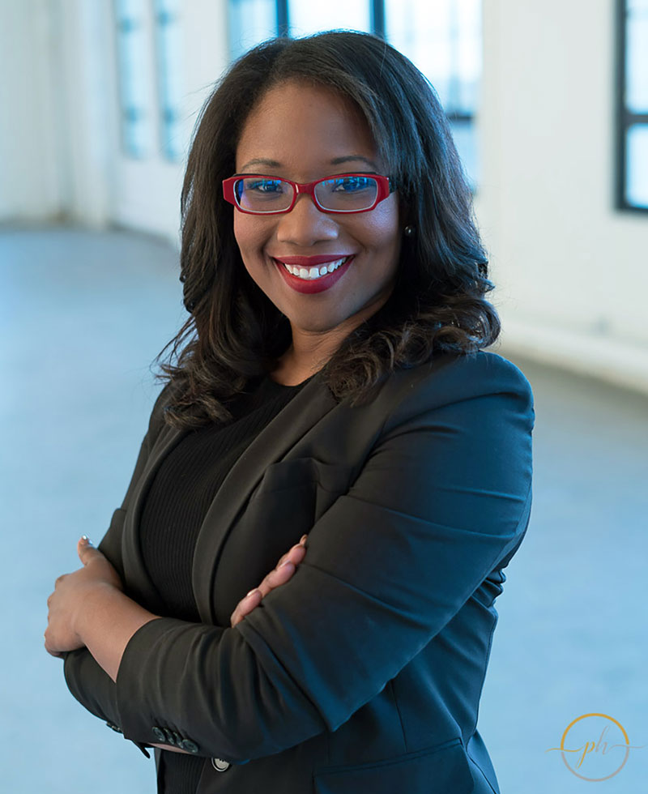

### Speaker: Talithia Williams, Big Data Expert, Math Professor & Host of NOVA Wonders

{:class="img-right-50"}A host of the PBS series, NOVA Wonders, Dr. Talithia Williams is a groundbreaking
professor, popular TED speaker, inspiring author and passionate STEM/STEAM advocate. She has
made it her life's work to get people of all ages and backgrounds excited about the bold
possibilities of a STEM education and to “STEMpower” women and minorities to enter these
professions. Her latest book, Power in Numbers: The Rebel Women of Mathematics reflects
Williams’ passion to re-brand the field of mathematics as anything but dry, technical or male-
dominated. Renowned for her popular TED Talk, “Own Your Body’s Data,” she advocates for all
of us to deploy data as a way of taking charge of our own health. A vibrant, engaging and
energizing speaker, Dr. Williams demystifies data, statistics, probabilities and the mathematical
process in amusing and insightful ways. She also passionately champions the contributions of
scientists, technologists, engineers and mathematicians and their vital role in transforming our
future.

Dr. Williams is Associate Dean for Research and Experiential Learning and Associate
Professor of Mathematics at Harvey Mudd College, where she develops statistical models which
emphasize the spatial and temporal structure of data, and applies them to real world problems.
Focused on data analytics, mathematics, statistical modeling and STEM Outreach, she is the first
African-American woman to achieve tenure at the college. She hosts NOVA Wonders, a PBS
mini-series that explores the biggest questions on the frontiers of science. The Los Angeles
Times praised the show for sending the message “that scientists come in a range of ages,
genders, colors and hairstyles.” She also appeared in NOVA’s Prediction by the Numbers, a
series exploring the history of probabilities and gambling which Forbes called, “an entertaining,
fun piece that conveys her knowledgeable and deep interest in this predictive method.” In
addition to her teaching and television work, she has partnered with the World Health
Organization in developing a cataract model used to predict the cataract surgical rate for
countries in Africa. Her professional experiences include research appointments at NASA’s Jet
Propulsion Laboratory, NASA’s Johnson Space Center, and the National Security Agency.

An exceptional communicator and gifted teacher, Dr. Williams won the Mathematical
Association of America’s Henry L. Alder Award for distinguished teaching. She also developed a
24-part college level lecture series on learning statistics for The Great Courses, an online platform
One Gateway Center, Suite 751 | Newton, MA 02458 | Phone: 617.614.1600 | Fax: 617.965.6610 | apbspeakers.com
for lifelong learners. Dr. Williams earned a bachelor’s degree in mathematics from Spelman
College, a master’s degree in mathematics from Howard University and a Ph.D. in statistics from
Rice University.

Described by audiences as engaging, relevant, funny, accessible, and a joy to work
with, Dr. Williams captivates and inspires with her contagious enthusiasm for STEM in general and
math in particular. Applying the data-driven approach made famous in her TED talk to a range
of subjects, she takes sophisticated numerical concepts and makes them understandable to a
wide audience, debunking perceptions with an energizing call to “show me the data!”

### Topics:
- The STEM Mindset: Creating the Future Generation
- Bringing Diversity to STEM: A Lesson in Disruptive Innovation
- Becoming an Agent of Change for Inclusive Education
- Innovative Technology: Engaging Students in Mathematics
- Using Data-informed Decisions to Drive Student Success in Higher Ed
- Personal Health Data Mining: The Empowered Patient
- Data Driven Strategies for Eliminating Health Disparities
- Power in Numbers: The Rebel Women of Mathematics
