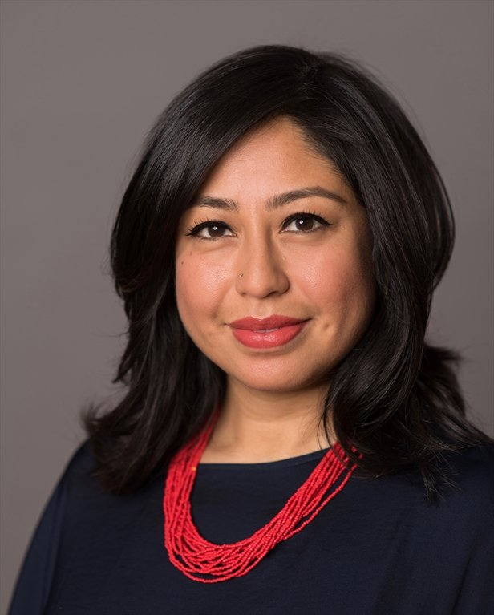
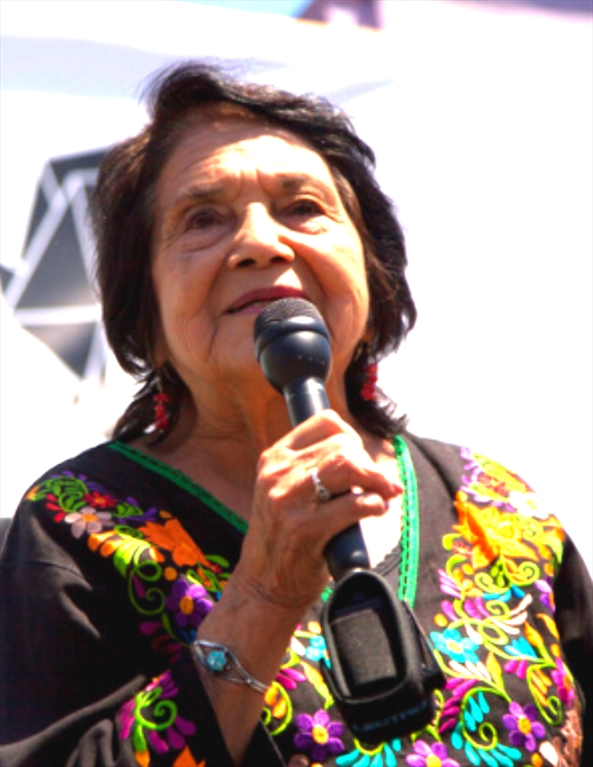
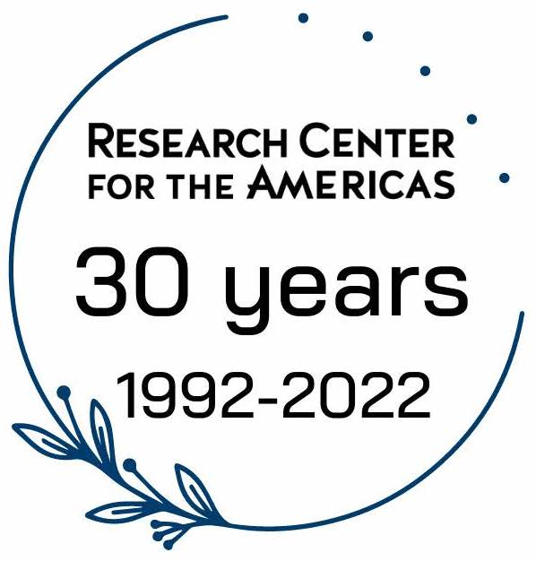

## Join Us!
# Sharing Futures, Speaking Truths

Please join us for a celebration with civil rights and feminist icon Dolores Huerta (distinguished honoree) and community organizer Cristina Jiménez (keynote speaker), co-founder of [United We Dream](https://unitedwedream.org), in honor of the 30th anniversary of the [Research Center for the Americas (RCA)](https://rca.ucsc.edu). Your admission ticket includes empanadas by our friends at [Colectivo Felix](https://www.fondafelix.com), desserts, a fun dance party with a DJ, and an interactive photo booth.

Distinguished guests will be joining us too. Check the [RCA website](https://rca.ucsc.edu/news-events/news/30th-anniversary-celebration.html) and follow us on social media for names of these surprise guests!

We look forward to seeing you and celebrating this milestone together on Thursday, October 20, 2022 at the [Cowell Ranch Hay Barn](https://www.google.com/maps/place/Hay+Barn/@36.9810332,-122.0542262,15z/data=!4m5!3m4!1s0x0:0x1daaf3d59260ed79!8m2!3d36.9810332!4d-122.0542262). Strict COVID Protocols will be followed to ensure a safe event with parking available nearby in [lots 115 and 116](https://taps.ucsc.edu/pdf/parking-map.pdf).

Our empanada reception will take place outdoors from 5–6 p.m.
The program begins at 6 p.m.

**Ticket Prices:**
- $35 UCSC Students (Limited Availability)
- $75 General Admission

Proceeds directly support RCA programs and operations.

## Keynote Speaker & Distinguished Honoree

  
  <section class="profile-w-media left">
    

      

        

          

              <h2 class="underline">Keynote Speaker: Cristina Jiménez</h2>
              

              Cristina Jiménez Moreta is a community organizer, political strategist, and storyteller. She is the Co-Founder and former Executive Director of <a href="https://unitedwedream.org">United We Dream</a> (UWD), the largest immigrant youth-led organization in the country. She migrated to the U.S. from Ecuador with her family at the age of 13, growing up undocumented.

              
Over the last decade under Cristina’s leadership, UWD has grown into a powerful network of one
million members and has played a pivotal role in shifting the narrative about immigrants and immigration, ultimately influencing policy. Cristina was instrumental in United We Dream’s successful campaign for President Obama to sign Deferred Action for Childhood Arrivals (DACA) into law.

              
In recognition of her work as a social justice organizer, Cristina received a 2017 MacArthur Fellowship, the Four Freedoms Award, and a spot on the TIME 100 List. Cristina has appeared in hundreds of national and local media outlets including <em>USA Today</em>, CNN, MSNBC, HBO, <em>The New York Times</em>, the <em>Los Angeles Times</em>, ABC, NPR, The Huffington Post, Univision, Telemundo, and <em>La Opinion</em>. Her writing has been published in <em>The New York Times</em>, CNN, USA Today, Huffington Post, and <em>El Diario</em>.

          

          

            

              
            
    
          

        

      

    

  </section>
  <section class="profile-w-media left">
    

      

        

          

              <h2 class="underline">Distinguished Honoree: Dolores Huerta</h2>
              

              Dolores Huerta is a civil rights and feminist icon and a 2011 Presidential Medal of Freedom recipient by President Obama.

              
Dolores Huerta found her calling as an organizer while serving in the leadership of the Stockton Community Service Organization (CSO). A community organizer at heart, she founded the Agricultural Workers Association, set up voter registration drives and pressed local governments for barrio improvements. In 1955, CSO founder Fred
Ross, Sr. introduced her to CSO Executive Director César E. Chávez, a likeminded colleague. The two soon discovered that they shared a common vision of organizing farm workers, an idea that was not in line with the CSO’s mission. As a result, César and Dolores resigned from the CSO and launched the National Farm Workers Association in the spring of 1962. Her organizing skills were essential to the growth of this budding organization. Dolores Huerta continues to work tirelessly developing leaders and advocating for the working poor, women, and children. As founder and president of the Dolores Huerta Foundation, she travels across the country engaging in campaigns and influencing legislation that supports equality and defends civil rights. In 2011, President Obama bestowed Dolores Huerta with her most prestigious award, The Presidential Medal of Freedom, the highest civilian award in the United States.

          

          

            

              
            
    
          

        

      

    

  </section>
  <section class="profile-w-media left">
    

      

        

          

              <h2 class="underline">About the Research Center for the Americas:</h2>
              

              Founded in 1992, the RCA at UC Santa Cruz is the first research center in the UC system to put in conversation the historically disconnected fields of Chicanx/Latinx and Latin American studies. As a multidisciplinary research unit, we bring together U.S. and international scholars to advance cross-border research, and professionally mentor students to prepare them for future career success. <a href="https://rca.ucsc.edu">Learn More!</a>

          

          

            

              
            
    
          

        

      

    

  </section>

 

### Thank you to our cosponsors:

UCSC Office of the Chancellor, Division of Social Sciences, Humanities Division, Arts Division, Institute for Social Transformation, The Humanities Institute, Institute for Arts and Sciences, Latin American and Latino Studies department, John R. Lewis College, Baskin Endowed Chair of Feminist Studies, and Bookshop Santa Cruz.

**[For more information, visit our webpage](https://rca.ucsc.edu)** 
Questions? Contact the Research Center for the Americas: [rca@ucsc.edu](mailto:rca@ucsc.edu)