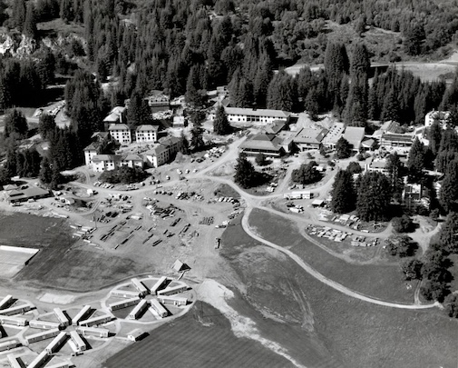
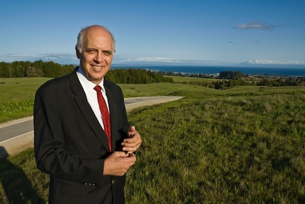

## The Imagining and Making of a University Campus at Santa Cruz

  
  <section class="profile-w-media left">
    

      

        

          

              

                Every alum has a story about how he or she first discovered and came to UC Santa Cruz. But the story of how the University of California came to Santa Cruz is a longer and much more involved one. Step into the Wayback Machine with UCSC’s Campus Architect Emeritus Frank Zwart (Cowell ’71) to hear the details of how the University’s Regents selected Santa Cruz as the site for their bold new experiment in public higher education, and learn about the University's first steps in building its new home. Along the way you’ll pick up some interesting UCSC architectural history trivia and some hidden jewels from the campus archives.
              

          

          

            

              
            
    
          

        

      

    

  </section>

 

## Speaker

  
  <section class="profile-w-media left">
    

      

        

          

              

                <strong>Frank Zwart, FAIA, FAUA,</strong> served as campus architect at the University of California, Santa Cruz, from 1988 until his retirement in 2010. Under his direction, the campus nearly doubled in size, adding nearly 2.4 million square feet of building space and renovating one million more, while preserving its breathtaking site. A Pasadena, California, native, Frank received his bachelor’s degree in mathematics from UC Santa Cruz (Cowell College) in 1971 and his master’s in architecture from Princeton University. Prior to joining the design and construction staff at UCSC in 1985, he worked in architectural firms in Princeton, Los Angeles, Santa Monica, Aptos, Philadelphia, and Carmel.
              

          

          

            

               
            
    
          

        

      

    

  </section>

 

<style>
  .profile-w-media {
    padding: 0 0 3rem;
  }
<style>
