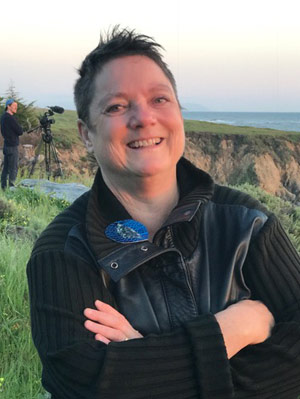

UC Santa Cruz Dean of the Arts Celine Parreñas Shimizu, in partnership with Art Professor Beth Stephens, invites you to a special evening reception at Performance Space New York. 

This will be an opportunity for Santa Cruz alumni and artists alike to mingle together in a creative and inclusive space. [Beth Stephens](https://art.ucsc.edu/people/elizabeth-stephens), UCSC professor of Environmental Justice, Documentary Films, Performance Art, Theory and Founder of the E.A.R.T.H. Lab Center & Dean Shimizu are eager to meet Santa Cruz alumni in NYC. 
 
This evening event will take place in the Nelima Theatre at Performance Space and will feature networking opportunities and remarks by Dean Celine Shimizu & Professor Stephens. Drinks and hors d’oeuvres will be served.

Register today for this very special evening celebrating the power of the Arts at UCSC. We hope you join us for this experience to cultivate new relationships, to immerse yourselves in an artistic environment, and to appreciate this iconic space.

This event is held at the conclusion of [Exploring the Earth as Lover: Assuming the Ecosexual Position](https://performancespacenewyork.org/shows/exploring-the-earth-as-lover/), a four-day symposium hosted by Professor Stephens & Annie Sprinkle

  
  <section class="profile-w-media left">
    

      

        

          

              <h2 class="underline">Celine Parreñas Shimizu</h2>
              

                Dean of the Arts and Distinguished Professor of Film and Digital Media at the University of California, Santa Cruz, and an award-winning film scholar and filmmaker. Her sixth book The Movies of Racial Childhoods is forthcoming from Duke University Press. Her third feature film 80 Years Later: On Japanese American Racial Inheritance (2022) won ten festival awards for historical documentary and excellence in directing.
              

          

          

            

              
            
    
          

        

      

    

  </section>

 

  
  <section class="profile-w-media left">
    

      

        

          

              <h2 class="underline">Beth Stephens</h2>
              
UCSC professor of Environmental Justice, Documentary Films, Performance Art, Theory and Founder of the E.A.R.T.H. Lab Center. She is a filmmaker, performance artist, activist, and theoretician and her work explores embodied ecologies, queerness, and pleasure in this age of environmental struggle. Her most recent project is the book, Assuming the Ecosexual Position: The Earth as Lover from the University of Minnesota Press, 2021. She is the Founding Director of the EARTH Lab (Environmental Art, Research, Theory, and Happenings) at UC Santa Cruz.

                
Stephens has exhibited visual art, created performance art pieces, theater pieces, and screened her films nationally and internationally at museums and galleries such as the San Francisco Museum of Modern Art, Reina Sofia in Madrid, Museum Kunst Palast in Dusseldorf, the Center for Contemporary Art in Moscow, MoMA New York, the 53rd Venice Biennale and documenta 14 in Athens, Greece and Kassel, Germany.

          

          

            

              
            
    
          

        

      

    

  </section>

 

