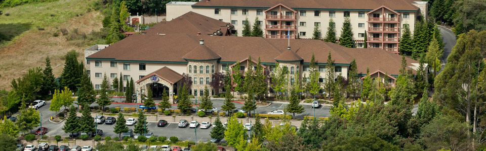
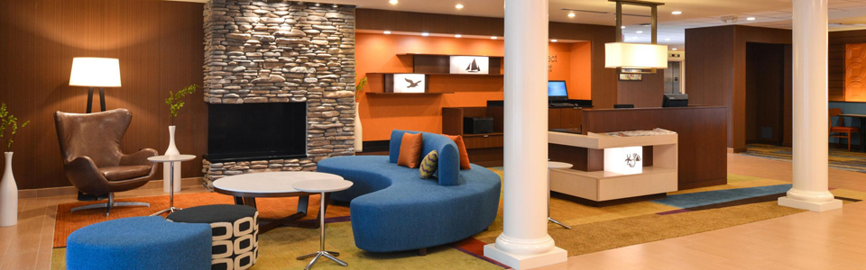
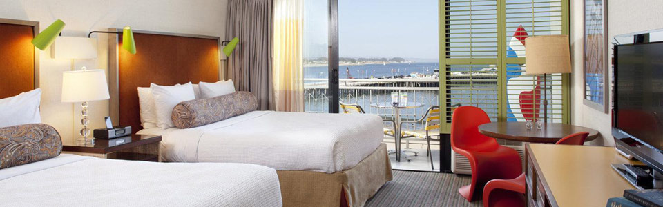

{: .underline}
## {{ page.title }}

### Hotel Paradox

Hotel Paradox is a boutique downtown hotel near the Boardwalk. Santa Cruz beaches and downtown shopping and dining are minutes from our door. Located just off Highway 1 and Highway 17 in downtown Santa Cruz.

**Phone Reservation:** (844) 236-8186 or [book online](https://www.marriott.com/events/start.mi?id=1579052459854&key=GRP)

---

### Hilton Santa Cruz/Scotts Valley

Just 10 minutes from downtown Santa Cruz, with a full range of amenities.

**Phone Reservation:** (800) 774-1500

---

### Fairfield Inn and Suites Santa Cruz

Overlooking Monterey Bay, this informal, contemporary hotel is a 10-minute walk from Natural Bridges State Beach and 3 miles from the Santa Cruz Beach Boardwalk.

**Phone Reservation:** (831) 420-0777

---

### Dream Inn

A Santa Cruz favorite for surfing, sunsets and the freshest seafood, the Dream Inn is a beloved local landmark on the historic Beach Boardwalk. Effortlessly captivating longtime guests with its colorful retro-chic style while delighting newcomers who appreciate modern services and amenities.

**Phone Reservation:** (844) 593-0142

